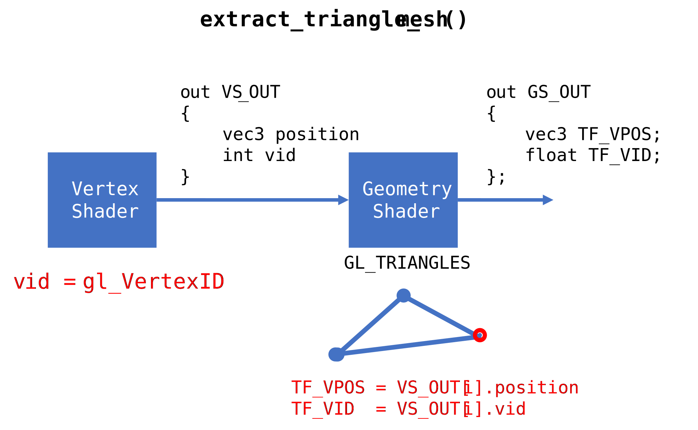

# opengl-geometry-dump
This repository contains the example implementation for extracting the primitives of graphics pipeline using transform feedback. I implemented two example scenarios. One is extracting vertex from triangle mesh, and another is extracting original geometry.   
  
The diagram below represents the idea of the function 'extract_triangle_mesh()' which implements original geometry extraction.  First, pass a unique vertex ID to the geometry shader. Then geometry shader writes position and ID of primitives to [transform feedback](https://www.khronos.org/opengl/wiki/Transform_Feedback) buffer. Finally, after the rendering process is finished, primitive information is copied to main memory. And mesh reconstruction is handled by unordered_map. For details, please see [main.cpp](src/main.cpp).

# Motivation
As far as I know, most transform feedback examples[1, 2] only explain or implement only point primitive extraction. So they cannot recover connectivity of the geometry. Of course that softwares such as [RenderDoc](https://renderdoc.org/), [glintercept](https://github.com/dtrebilco/glintercept) can do similar thing. But we cannot extract geometry programatically with RenderDoc, and glintercept cannot be running other than Windows environment.

# Getting Started
You can build this project with CMake. Please see [CMakeLists.txt](CMakeLists.txt) (very short)

## Dependencies
Easiest way to install the dependencies is vcpkg.
- GLUT, GLEW, GLM, OpenMesh

# To Do
- [ ] Support extracting additionally generated geometry.
- [x] Connectivity extraction and original geometry recovering.
- [ ] Librarify 

# References
[1] [Particle System using Transform Feedback](https://ogldev.org/www/tutorial28/tutorial28.html)  
[2] [Transform feedback - Feedbacktransform and geometry shaders](https://open.gl/feedback)